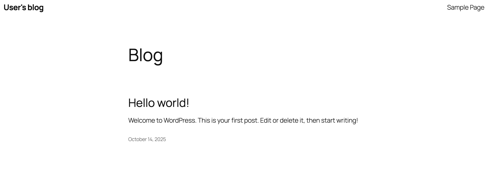

<!-- size: 16:9 -->
<!-- theme: default -->

<!-- paginate: false -->

<!-- headingDivider: 1 -->

<style>
h1 {
  text-align: center;
}
img[alt~="center"] {
  display: block;
  margin: 0 auto;
}
</style>

# DOCKER - Parte 2


---

## Recordatorio...


`docker ps` Contenedores creados en ejecución

`docker ps -a` Contenedores creados (incluye los que están parados)

`docker container ls` (con o sin -a)

`docker run NOMBRE_IMAGEN` Crear un contenedor (si no tiene la imagen en local, la descarga)

`docker image ls` Ver las imágenes disponibles en local 


Docker da un nombre aleatorio a los contenedores si no lo elegimos nosotros. Todos los contenedores tienen un ID

```bash
$ docker ps -a
CONTAINER ID   IMAGE                    COMMAND                  CREATED         STATUS                      PORTS     NAMES
c8bb700e5f39   hello-world              "/hello"                 5 seconds ago   Exited (0) 4 seconds ago              busy_haibt
efe18fd91e7b   dodero/myserver:latest   "/bin/sh -c 'apache2…"   20 hours ago    Exited (130) 20 hours ago             myserver
```

---

`docker rm busy_haibt` Para borrar contenedores

`docker rm c8b` (no hace falta el ID completo)

Elegir el nombre del contenedor (debe ser único en local):

`docker run --name=hola hello-world`

Crear un contenedor asignando un puerto random en local:

`docker run -d -P --name=nginx-server nginx`

`docker ps -a` (para ver puerto asignado)

Ejecutar terminal en el contenedor creado:

`docker exec -it nginx-server /bin/bash`

---

Construir una imagen nueva

```bash
mkdir mi-apache
nano index.html
mv index.html mi-apache
nano Dockerfile
```

Dockerfile:
```docker
FROM bitnami/apache
COPY index.html /opt/bitnami/apache/htdocs/index.html
```

```bash
docker build -t usuario/mi-apache .
docker run -d -P --name=mi-apache-1 usuario/mi-apache
```

Subir nueva imagen a Docker Hub:

`docker push usuario/mi-apache`

---

## Directorios enlazados y volúmenes

Para compartir información con Docker cuando necesitamos:

- Compartir un __directorio__ entre múltiple contenedores.
- Compartir un __directorio__ entre el host y un contenedor.
- Compartir un __fichero__ entre el host y un contenedor.

Opciones:

- __Directorios enlazados__ *(bind):* la información se guarda fuera de Docker en el host local. Esta opción es mejor para datos no generados por los contenedores.
- __Volúmenes__: la información se guarda usando Docker. Mejor para datos generados por los propios contenedores.

---

## Directorios enlazados (bind)

Características:

- Permiten  __persistencia__  de la información del contenedor.
- Se montan en un  __path específico de la máquina local__  (fuera de Docker).
- Permiten  __borrar los contenedores sin perder la información__ .

---

### Ejemplo con directorios enlazados (bind) (1)

Crear directorio local `p02` para compartir:

`mkdir /Users/Usuario/p02`

Ejecutar el contenedor:

```bash
docker run -d -P --name=apache-bind-1 \
  --mount type=bind,source=`pwd`/p02,target=/usr/local/apache2/htdocs httpd
```

Comprobar los puertos a los que se ha asignado el 8080 (http) y 8443 (https) del Servidor Apache configurado en el contenedor:

```bash
$ docker ps -a
CONTAINER ID   IMAGE  COMMAND             CREATED        STATUS         PORTS                   NAMES
...
b30ef7b4060a   httpd  "httpd-foreground"  3 minutes ago  Up 3 minutes   0.0.0.0:55000->80/tcp   apache-bind-1
...
```

---

Editar el fichero con _nano_ (u otro editor)

`nano /Users/Usuario/p02/index.html`

```html
<!DOCTYPE html>
<html lang="es">
<head>
  <meta charset="utf-8">
  <title>Apache en Docker</title>
  <meta name="viewport" content="width=device-width, initial-scale=1.0">
</head>
<body>
  <h1>Hola Usuario! :)</h1>
</body>
</html>
```


---

Reiniciar Apache para que muestre los cambios. También podemos reiniciar el contenedor con `docker restart apache-bind-1`

Abrir en el host la URL http://localhost:55000/


Si eliminamos el contenedor, no perdemos el contenido de la web:


```bash
docker stop apache-bind-1
docker rm apache-bind-1
docker run -d -P --name=apache-bind-2 \
  --mount type=bind,source=`pwd`/p02,target=/usr/local/apache2/htdocs httpd
```

---

## Volúmenes

### Características

- Permiten persistencia de información del contenedor
- Se montan en un _path_ específico del contenedor
- El acceso a la información sólo puede realizarse a través de Docker


### Ejemplo con volúmenes (1)

Creando un volumen para la web

`docker volume create --name vol-apache`

```
docker run -d -P --name=apache-volume-1 \
   --mount type=volume,source=vol-apache,target=/usr/local/apache2/htdocs httpd
```

Comprobar el puerto asignado con `docker ps -a `

---

Acceso al volumen

`docker volume ls`

`docker exec -it apache-volume-1 /bin/bash`

Comprobar que `/usr/local/apache2/htdocs` tiene el contenido original (se ha copiado al volumen) y salir con `exit`

Actualizamos el contenido del volumen

`nano index.html`

`docker cp index.html apache-volume-1:usr/local/apache2/htdocs/`

Acceso de nuevo al volumen y comprobar que el archivo `index.html` se ha modificado

`docker exec -it apache-volume-1 /bin/bash`


---

Acceso al contenido de la web


Compartir volumen con otro contenedor

```
docker run -d -P --name=apache-volume-2 \
   --mount type=volume,source=vol-apache,target=/usr/local/apache2/htdocs httpd
```

---

Borrando volumen

```
docker stop apache-volume-2
docker rm apache-volume-2
```

`docker volume rm vol-apache`

```
Error response from daemon: remove vol-apache: volume is in use - [4a4794f86...3c8]
```

Reintentar borrado:

```
docker stop apache-volume-1
docker rm apache-volume-1
docker rm apache-volume-2
docker volume rm vol-apache
```

Comprobar que se ha borrado con `docker volume ls`

---

### Solo lectura

Los directorios enlazados (bind) y los volúmenes pueden ser montados en modo de solo lectura.

Los contenedores pueden leer los datos, pero no pueden modificarlos. Esto es útil para proteger datos críticos de cambios accidentales. Ejemplos de uso:

```bash
docker run -d -p 8080:80 \
  --mount type=bind,source=`pwd`/p02,target=/usr/local/apache2/htdocs,readonly httpd
```
```bash
docker run -d -p 8081:80 \
  --mount type=volume,source=vol-apache,target=/usr/local/apache2/htdocs,readonly httpd
```

Si instalo un editor en el contenedor y trato de modificar el fichero `index.html`, obtendré un error de permisos.

---

##  Configuraciones de red

- Permiten comunicación entre todos los contenedores pertenecientes a una red a través del nombre del contenedor
- Permiten aislamiento con respecto a otros contenedores
- Un contenedor puede pertenecer a varias redes

---

###  Tipos de redes

Ver las redes existentes: `docker network ls`

```bash
$ docker network ls
NETWORK ID     NAME      DRIVER    SCOPE
21c353b4b7a5   bridge    bridge    local
7a7abec15748   host      host      local
40157ecf9fcf   none      null      local
```

- **host** representa la red del propio equipo y haría referencia a `eth0`
- **bridge** representa la red `docker0` y a ella se conectan todos los contenedores por defecto
- **none** significa que el contenedor no se incluye en ninguna red. Si verificamos esto con el comando `ifconfig` dentro del contenedor, veríamos que sólo tiene la interfaz de loopback `lo`

Saber qué contenedores usan un tipo de red y su información de red: `docker network inspect bridge`

---

###  Ejemplo de configuración de red (1)

WordPress empaquetado en un contenedor:

https://hub.docker.com/r/bitnami/wordpress
https://github.com/bitnami/charts/tree/main/bitnami/wordpress

Crear una nueva red:

`docker network create wordpress-network`

Crear primer volumen para persistencia de MariaDB:

`docker volume create --name mariadb_data`

Crear segundo volumen para persistencia de WordPress:

`docker volume create --name wordpress_data`

---

Crear primer contenedor que usa la red (base de datos `mariadb`):

```bash
docker run -d --name mariadb --env ALLOW_EMPTY_PASSWORD=yes \
  --env MARIADB_USER=bn_wordpress \
  --env MARIADB_DATABASE=bitnami_wordpress \
  --network wordpress-network \
  --volume mariadb_data:/bitnami/mariadb \
  bitnami/mariadb:latest
```

Crear segundo contenedor que usa la red (servidor `wordpress`):

```bash
docker run -d --name wordpress -p 8080:8080 -p 8443:8443 \
  --env ALLOW_EMPTY_PASSWORD=yes \
  --env WORDPRESS_DATABASE_USER=bn_wordpress \
  --env WORDPRESS_DATABASE_NAME=bitnami_wordpress \
  --network wordpress-network \
  --volume wordpress_data:/bitnami/wordpress \
  bitnami/wordpress:latest
```

---



# Ejercicio 1: Probar el wordpress creado

1. Acceder a `http://localhost:8080/wp-admin/` para administrar WordPress (buscar usuario y contraseña en la documentación)
2. Crear una nueva página desde Pages > Add New Page
3. Acceder a `http://localhost:8080/` para ver la página creada
4. Borrar los contenedores creados y comprobarlo en el navegador
5. Crear de nuevo los contenedores. ¿La página sigue existiendo? ¿Por qué?
6. Borrar los contenedores y los volúmenes creados
7. Crear de nuevo los contenedores y los volúmenes. ¿La página sigue existiendo? ¿Por qué?


# Ejercicio 2: Nginx con red y volumen compartido

## Parte 1

1. Crear volumen compartido `volumenDocker`
2. Crear un contenedor de Nginx que use el volumen `volumenDocker`.
3. Modifique el contenido del fichero `index.html` incluyendo un saludo personal en lugar del texto por defecto.
4. Cree un segundo contenedor que también use el volumen `volumenDocker`.
5. Compruebe que puede acceder a `localhost:81` (primer contenedor) y `localhost:82` (segundo contenedor) y ver el contenido de `index.html`.

---

## Parte 2

1. Crear una nueva red `redDocker`.
2. Crear un contenedor de Ubuntu `Ubuntu1` conectado a redDocker.
3. Crear un contenedor de Ubuntu `Ubuntu2` sin conectarlo a redDocker.
3. Instalar los paquetes necesarios y hacer ping a `Ubuntu1` desde `Ubuntu2`. ¿Funciona? ¿Por qué?.
4. Buscar en la documentación cómo conectar un contenedor existente a una red y conectar `Ubuntu2` a la red `redDocker`.
5. Intentar de nuevo hacer ping a `Ubuntu1` desde `Ubuntu2`. ¿Funciona? ¿Por qué?.
